# Task API

A simple CRUD (Create, Read, Update, Delete) REST API for managing a to-do list, built with **FastAPI** and **Python**. This project started as an in-memory learning assignment focused on HTTP, CRUD, status codes, and Swagger UI, and has since been extended to use a persistent PostgreSQL database running in Docker.

## What this project is

This API lets a client:
- **Create** a new task
- **Read** all tasks or a single task
- **Update** a task's title or completed status
- **Delete** a task

## How to install and run it

1. Clone this repository:

   ```
   git clone https://github.com/Malaika-CS/task-crud-api.git
   cd task-crud-api
   ```

2. Start the full stack (API + PostgreSQL database) with Docker:

   ```
   docker compose up --build
   ```

3. The API will be running at `http://localhost:8000`

4. Open the interactive Swagger UI documentation at:

   ```
   http://localhost:8000/docs
   ```

## Endpoints

| Method | Endpoint            | Description                          | Success Code | Error Codes |
|--------|----------------------|---------------------------------------|---------------|-------------|
| GET    | `/`                  | API info                              | 200           | -           |
| GET    | `/health`            | Health check                          | 200           | -           |
| GET    | `/tasks`             | List all tasks                        | 200           | -           |
| GET    | `/tasks/{task_id}`   | Get a single task by ID                | 200           | 404         |
| POST   | `/tasks`             | Create a new task                     | 201           | 400         |
| PUT    | `/tasks/{task_id}`   | Update a task's title and/or status    | 200           | 400, 404    |
| DELETE | `/tasks/{task_id}`   | Delete a task                         | 204           | 404         |

## Example request (curl)

```
curl -i -X POST http://localhost:8000/tasks -H "Content-Type: application/json" -d '{"title":"Buy milk"}'
```

Example response:

```
HTTP/1.1 201 Created
content-type: application/json
{"id":4,"title":"Buy milk","done":false}
```

## Swagger UI — Full Testing Walkthrough

Every endpoint was tested through the interactive Swagger UI (`/docs`) using "Try it out". Screenshots for each step are below.

### GET / (root)
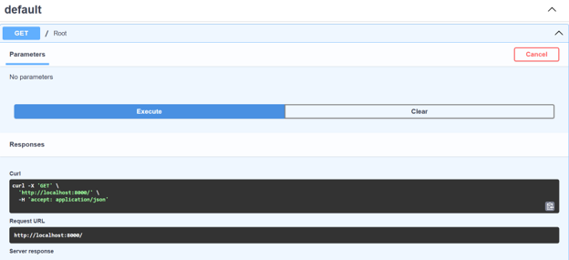
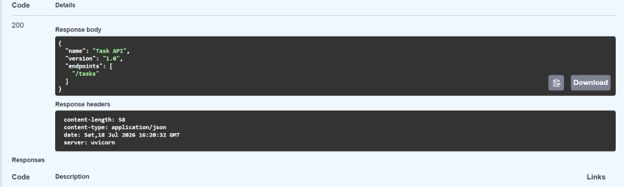
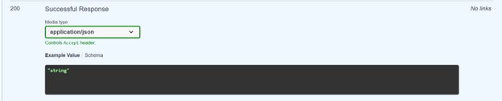

### GET /health
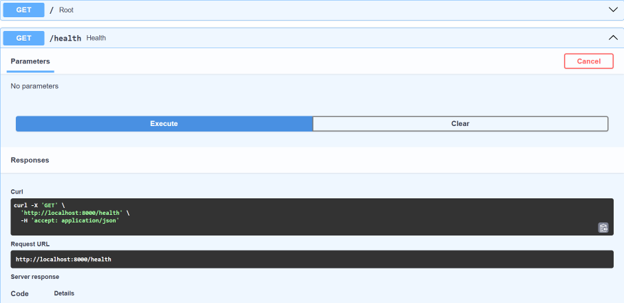
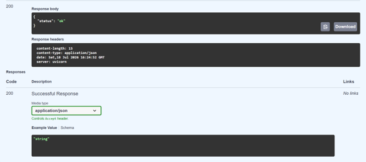

### GET /tasks
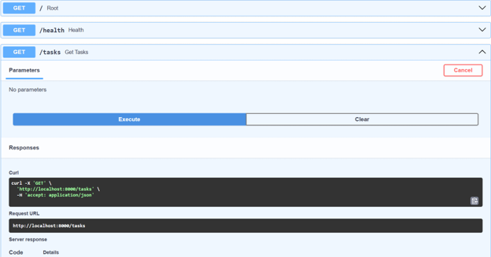
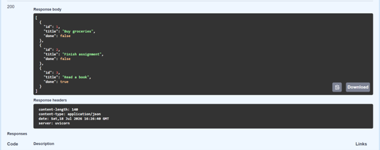
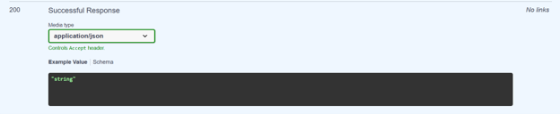

### GET /tasks/{task_id}
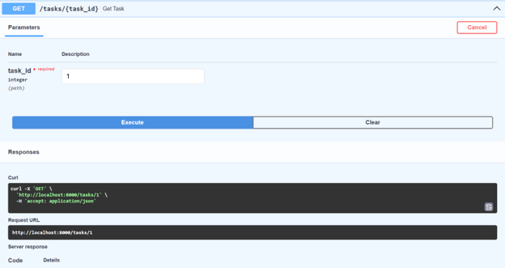
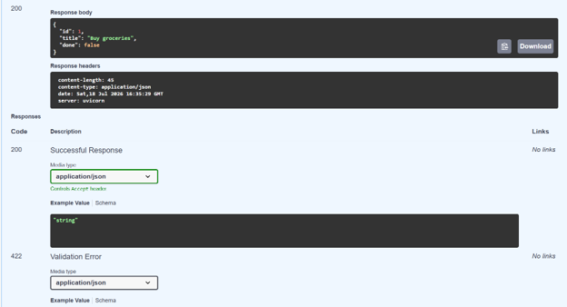
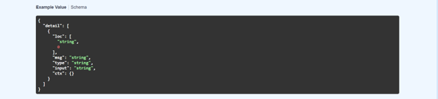
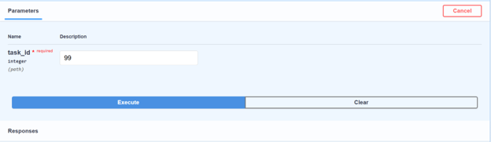
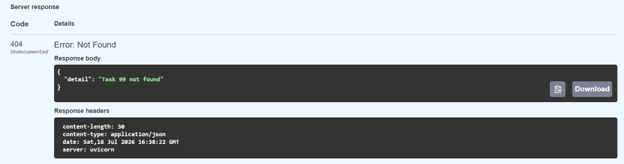

### POST /tasks
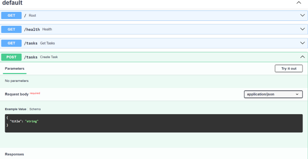
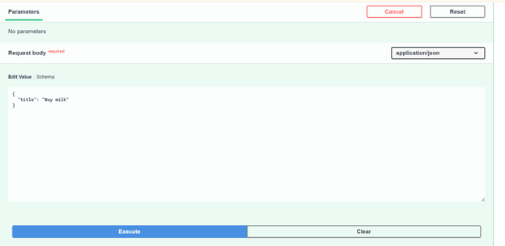
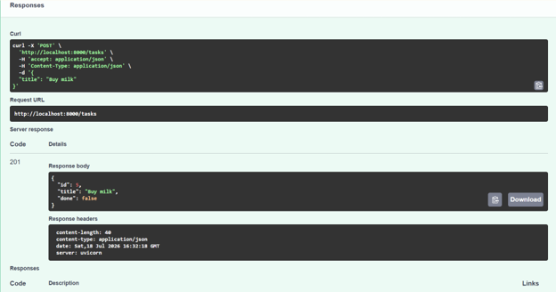
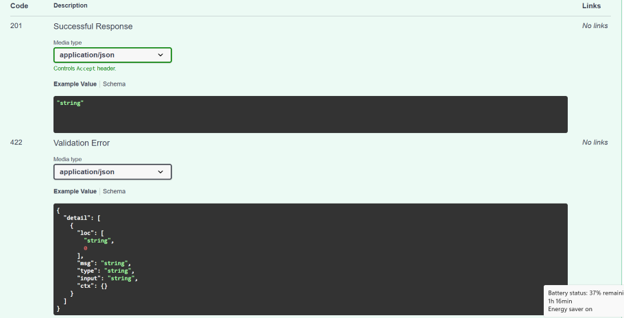

### PUT /tasks/{task_id}
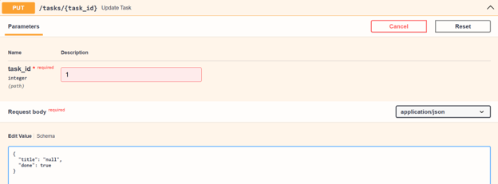
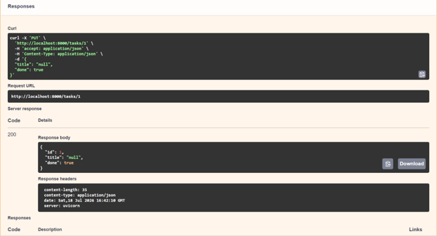
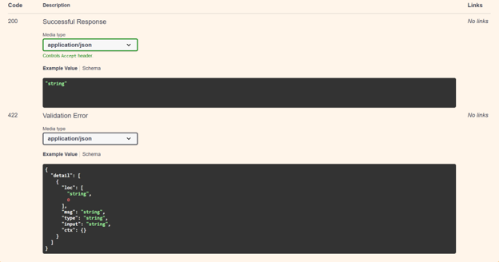

### DELETE /tasks/{task_id}
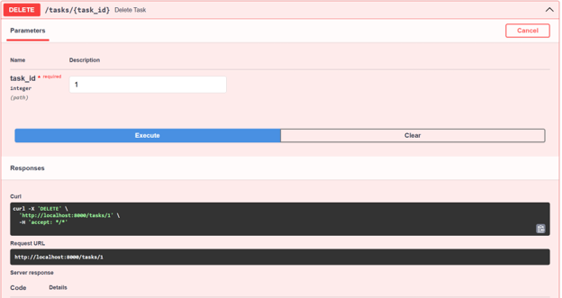
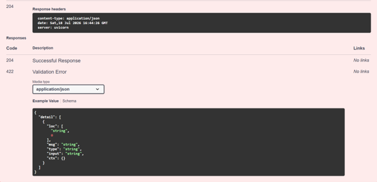

## Notes

- Input is validated: creating or updating a task with an empty title returns a `400` error.
- Requesting a task ID that doesn't exist returns a `404` error with a JSON message.

## Week 3 Update — Containerization

This week's update migrates the API from in-memory storage to a persistent PostgreSQL database, and containerizes the entire stack with Docker.

### What changed

- **PostgreSQL** now runs in a Docker container with a persistent volume, replacing the in-memory Python list used in Week 2.
- **SQLAlchemy** is used as the ORM layer, with a `Task` model mapped to a `tasks` table.
- The database connection string is stored in a `.env` file (excluded from version control via `.gitignore`), with a `.env.example` committed as a template for other developers.
- **Service and route logic were not changed** — only the underlying repository/storage layer was swapped. This confirms the original architecture correctly isolated the storage implementation from business logic.
- The full stack (API + database) now starts with a single command via `docker-compose.yml`.

### How to run

```
docker compose up --build
```

Then open the interactive API docs at:

```
http://localhost:8000/docs
```

### Persistence verification

1. A task was created via `POST /tasks`.
2. The stack was stopped with `docker compose down`.
3. The stack was restarted with `docker compose up`.
4. `GET /tasks` confirmed the previously created task was still present in the database.

This confirms data now persists across both application and container restarts, unlike the Week 2 in-memory version.
